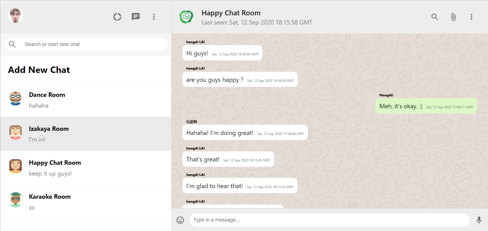

# Real-time Chatting App - Design of [Whatsapp-Clone](https://whatsapp-clone-847bd.web.app/)
 This app serves as a data dashboard to visualise COVID-19 pandemic situation both on a gobal scale and in each specific country
 

 

## General Highlights of the Whatsapp-Clone App:
    
   |    Highlights                      |                         Description                                                                               |
   |:----------------------------------:| ------------------------------------------------------------------------------------------------------------------|  
   | **Responsive Design:**             | The App is scalable with width and height change, and work well on mobile screens                                 |
   | **Add New Chatroom:**          | Items in the dropdown could be selected and have relative data pulled out and represented in line graph and on map|
   | **Multiple Chat Data Collection Storage:**          | -      |
   | **Google User Authentication:** | - [[1]](#fn_1))                    |
   | **Message Sending with User Id:** | -|
   | **Smooth Chat Room Scrolldown:**         | - [[3]](#fn_3)           |   
 

## Languages and Tools:

   |    Syntax   |                         Description                                       |
   | :---------: | :-----------------------------------------------------------------------: |  
   | Library   | React.js with Hooks/Function Component/Context API (State Management)|
   | Languages   | Javascript/CSS in BEM[[4]](#fn_4) /HTML        |
   | Code Editor | Visual Studio Code                                                        |
   | Hosting     | Firebase Hosting Service                                                  |
   | Database    | Cloud Firestore by Google                                                 |

- *All code for this project could be found in the 'src' folder.*

 

## External Plugins 
 

## Components
 

## My Other Open Source Projects
 

## Footnodes

<b id="fn_1">[1]</b> [something](https://google.com/) is something. [↩](#footnode_1)  
<b id="fn_2">[2]</b> [something](https://google.com/) is something [↩](#footnode_2)  
<b id="fn_3">[3]</b> [something](https://google.com/) is something [↩](#footnode_3)  
<b id="fn_4">[4]</b> BEM refers to the Block, Element, Modifier methodology which allows code to be scalable and reusable. [↩](#footnode_4)  

